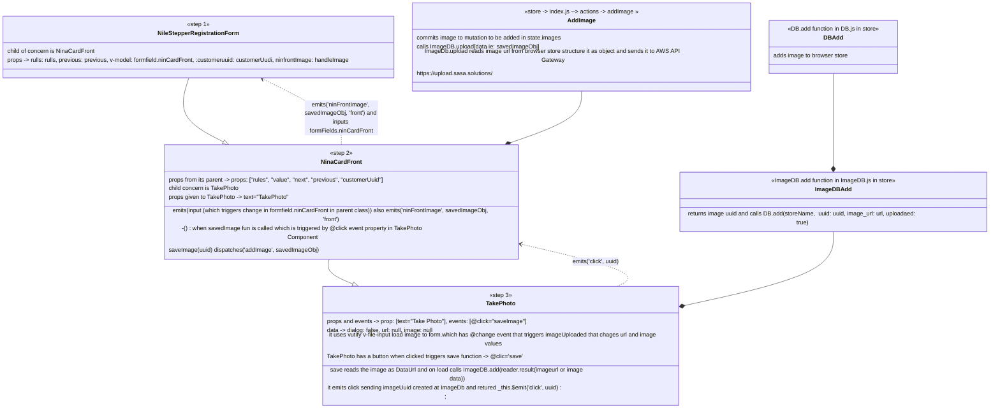

Front end flow of ID front image!

```mermaid
classDiagram
  class NileStepperRegistrationForm{
      <<step 1>>
      child of concern is NinaCardFront 
      props -> rulls: rulls, previous: previous, v-model: formfield.ninCardFront, :customeruuid: customerUudi, ninfrontImage: handleImage
  }
  NileStepperRegistrationForm --|> NinaCardFront

  class NinaCardFront{
      <<step 2>>
      props from its parent -> props: ["rules", "value", "next", "previous", "customerUuid"]
      child  concern is TakePhoto 
      props given to TakePhoto -> text="TakePhoto"
      emits(input (which triggers change in formfield.ninCardFront in parent class)) also emits('ninFrontImage', savedImageObj, 'front' )
      -() when savedImage fun is called which is triggered by @click event property in TakePhoto Component
      saveImage(uuid) dispatches('addImage', savedImageObj)

  }

  NinaCardFront --|> TakePhoto

  class TakePhoto{
      <<step 3>>
      props and events -> prop: [text="Take Photo"], events: [@click="saveImage"]
      data -> dialog: false, url: null, image: null
      it uses vutify v-file-input load image to form.which has @change event that triggers imageUploaded that chages url and image values
      TakePhoto has a button when clicked triggers save function -> @clic='save'
      save reads the image as DataUrl and on load calls ImageDB.add(reader.result(imageurl or image data))
      it emits click sending imageUuid created at ImageDb and retured _this.$emit('click', uuid);

      
  }

  class ImageDBAdd {
      <<ImageDB.add function in ImageDB.js in store>>
      returns image uuid and calls DB.add(storeName,  uuid: uuid, image_url: url, uploadaed: true )
  }

  ImageDBAdd --* TakePhoto

  class DBAdd{
      <<DB.add function in DB.js in store>>
      adds image to browser store
  }

  DBAdd --* ImageDBAdd

  class AddImage {
      <<store -> index.js --> actions -> addImage >>
      commits image to mutation to be added in state.images
      calls ImageDB.upload[data ie: savedImageObj]
      ImageDb.upload reads image url from browser store structure it as object and sends it to AWS API Gateway
      https://upload.sasa.solutions/
  }

  AddImage --* NinaCardFront

  TakePhoto ..> NinaCardFront : emits('click', uuid)

  NinaCardFront ..> NileStepperRegistrationForm :emits('ninFrontImage', savedImageObj, 'front') and inputs formFields.ninCardFront

```